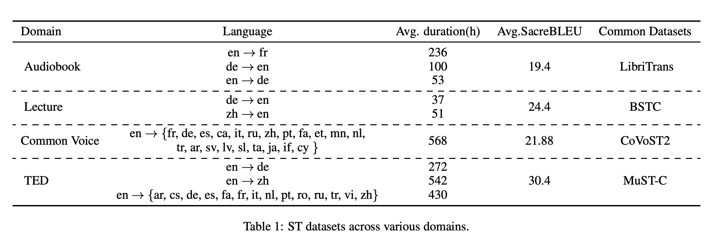

### Papers:

#### Main paper very similar to what we want to do:

[EASIST](https://arxiv.org/pdf/2504.11809)

2 Related Work continue from here

#### Review paper:
https://arxiv.org/pdf/2406.00497

Stopped on the section 4.2

###

### Conaiki questions:

1. Basically we are working on SimulST so for us it's important to provide translation that is correct in therms of meaning and do it faster than 3 sec as max threshold. 

But for that how can we translate
 - EN: "We saw him last night" 
 - KK: "Біз оны кеше түнде көрдік." 
 
 Біз → “We” (subject, 1st person plural). оны → “him” (accusative form of ол, marking the direct object). кеше түнде → “last night” (кеше = yesterday, түнде = at night). Together it expresses the English “last night.” көрдік → “saw” (past tense, 1st person plural of көру “to see”). So even in simple cases we receive non-monotonic result. How can we address it? Can you think what we will do? Basically question is, can we apply monotonic translation for the {kk,en,ru}? Will it work out or not.

2. What is english russian and kazakh language families? 
* Kazakh -> Turkic
* English -> Indo-European (Germanic)
* Russian -> Indo-European (Slavic)

#### Some info about languages:
Turkic is SOV (Subject-Object-Verb)
English is SVO (Subject-Verb-Object)